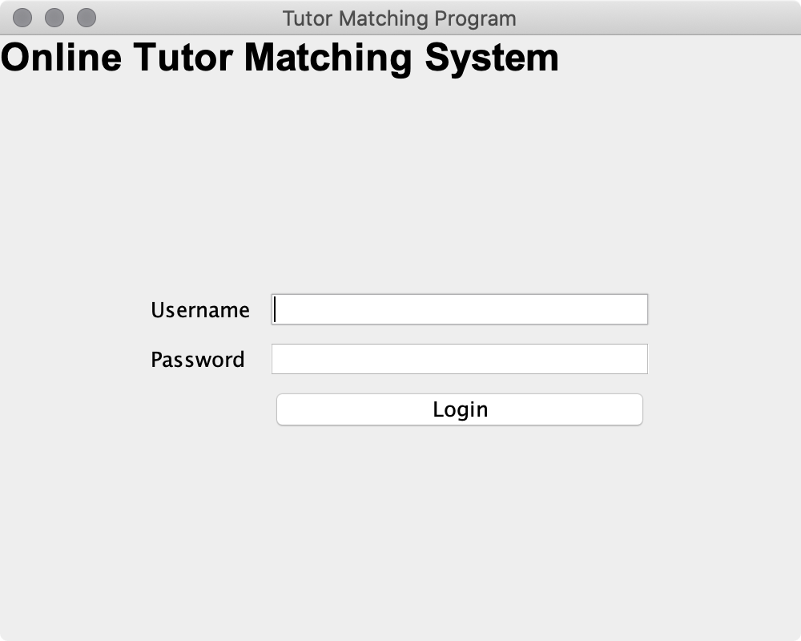
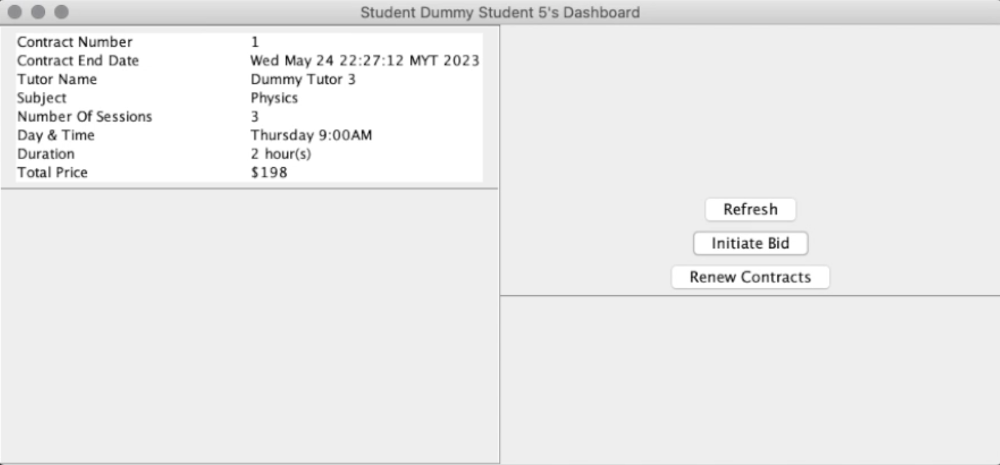
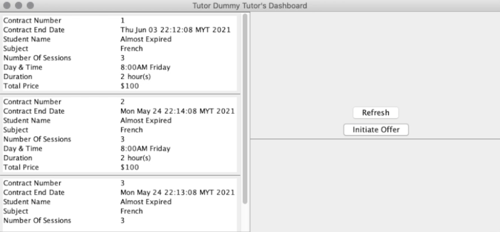

# TeraBytes: Tutor-Student Matching App

## Preface

TeraBytes is a project that aims to connect an students to tutors through a bididng and contract formation system. It helps to place prospective students in touch with private tutors. 

Students can initiate bids in the bid marketplace alongside with preferences such as day, time, subject, qualification, rate, etc.  Tutors can browse the bid marketplace to either buyout the bids or offer an alternative bid to the students.  Upon agreement by student or tutor, a contract is then formed between the both parties with a specified contract duration. 

The system applies the following architectures/design in building the application: 
- [Model-View Controller](https://en.wikipedia.org/wiki/Model%E2%80%93view%E2%80%93controller) for overall architecture
- [Adapter pattern](https://refactoring.guru/design-patterns/adapter) to serialize JSONs to corresponding objects
- [Template pattern](https://refactoring.guru/design-patterns/template-method) to generalize common views across different user interfaces
- [Observer pattern](https://refactoring.guru/design-patterns/observer) to notify the views to update when invoked by users
- [Strategy pattern](https://refactoring.guru/design-patterns/strategy) to switch different methods of renewing a contract between student and tutor
- [Builder pattern](https://refactoring.guru/design-patterns/builder) to build objects used throughout the application

The application includes the following functionalities, which are extensible: 
- Login system by tutor/student
- Student and tutor home dashboard showing the contracts signed
- Tutor monitoring dashboard showing the bids to be monitored / bookmarked by tutors 
- Bidding system for tutors to bid on the students' requirements: 
	- Open bidding: where tutors are allowed to provide offers for the students' bids or buy out immediately
	- Close bidding: where tutors can respond and provide offers to student' bid request through messages 
- Contract formation and signing between students and tutors 
- Contract renewal for renewing expired contracts 

## Installation Guide
Clone the project then choose one of the following options to execute.

### From the command line
1. install maven
2. `mvn compile`
3. `mvn exec:java -Dexec.mainClass=engine.Driver`

### From an IDE
1. Open this in IntelilJ IDEA
2. Go to Preferences -> GUI Designer -> Generate GUI into Java source codes
3. Run Driver class

### Login Credentials
Use the following accounts to login:\
Username: dummystudent\
Password: dummystudent

Username: dummytutor\
Password: dummytutor

## Directories
For design documents: refer to [app_docs](./app_docs/)\
For application demo: refer to [app_demo](./app_demo/)

## Screenshots

	
	
	

## License
 
This project is licensed under [Apache License 2.0](https://opensource.org/licenses/Apache-2.0). All main conditions require preservation of copyright and license notices. View [LICENSE](/LICENSE) for more information.

